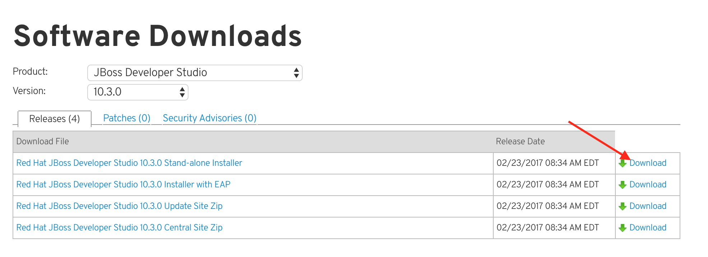
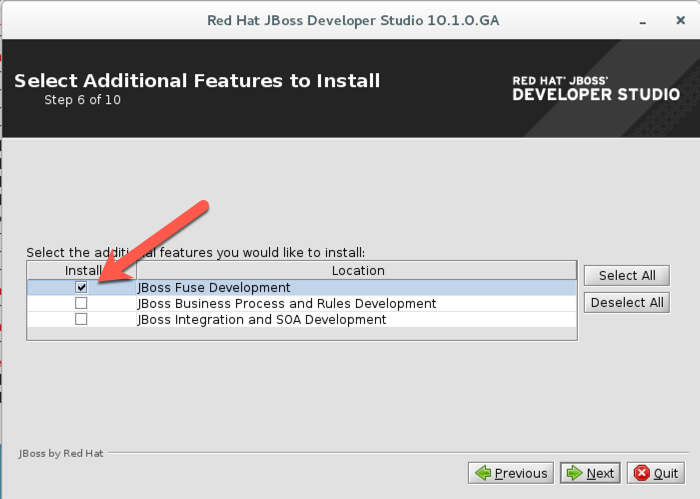
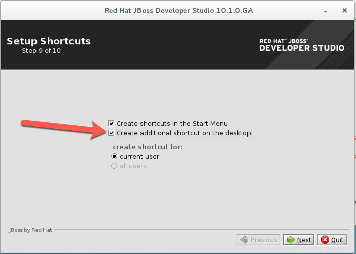
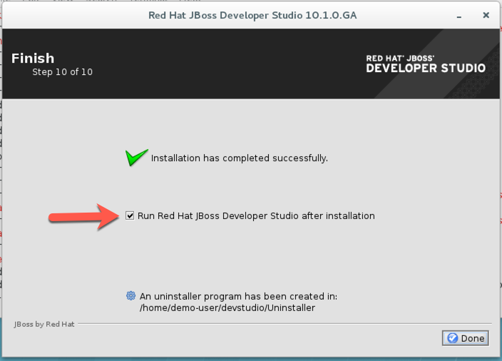

= IoT Summit Lab 2017 - Building a VM

:Author:    Patrick Steiner
:Email:     psteiner@redhat.com
:Date:      03.3.2017

:toc: macro

toc::[]

== Scope
This document is intended for those people who would like to perform the
IoT-Lab, as described in this repository.

The instructions are based on Red Hat Enterprise Linux 7.3 (RHEL) running on a VM or a physical hardware.

== Pre-Requisite
You will need to install a RHEL V7.3 with:

 * 2 CPUs
 * 4 GB RAM ( more is always good )
 * 15 GB Storage

During the installation please select to install the server with GUI.

image:images/install_gui.png[]

For simplicity we will use the default setting for the disk partitions.

image:images/install_hd.png[]

Also make sure that your network is activated.

image:images/install_network.png[]

I usually create a user called "demo-user" with admin rights, but you can call
your user whatever you want.

image:images/install_user.png[]

After completing the install precedure, register and upgrade your RHEL installation:


```
[demo-user@iotlab Desktop]$ sudo subscription-manager register --username=rhnuser --password=rhnpasswd`
[demo-user@iotlab Desktop]$ sudo subscription-manager attach --pool=pool_id
[demo-user@iotlab Desktop]$ sudo yum upgrade

```
== Provisioning the Gateway
=== Pre-Requisite

==== Install git

  [user@localhost ~]$ sudo yum install git

==== Install Ansible

  [user@localhost ~]$ rpm -Uvh https://dl.fedoraproject.org/pub/epel/epel-release-latest-7.noarch.rpm
  [user@localhost ~]$ sudo yum install ansible

==== Download JBOSS Fuse 6.3.0

Please download https://access.redhat.com/jbossnetwork/restricted/softwareDownload.html?softwareId=46901[Red Hat JBoss Fuse V6.3.0]
and save it in the `Downloads` folder

image:images/download_fuse.png[]

==== Download JBoss BRMS V6.4.0

Please download https://www.redhat.com/en/technologies/jboss-middleware/business-rules[JBoss BRMS]
and it's pre-requisites from the Red Hat Customer portal and place all three files
into the `Downloads` folder

 * https://access.redhat.com/jbossnetwork/restricted/softwareDownload.html?softwareId=43891[JBoss EAP V7.0.0]
 * https://access.redhat.com/jbossnetwork/restricted/softwareDownload.html?softwareId=49331[JBoss EAP V7.0.4 Patch]
 * https://access.redhat.com/jbossnetwork/restricted/softwareDownload.html?softwareId=48291[Red Hat JBoss BRMS 6.4.0 Deployable for EAP 7]

==== Configure the Deployment Script

To customize the installation script to your needs, please update the file `Ansible/BuildGW`
and change the following value to the name of the user, who should be running the lab:

 set_fact: user='user name'

_Note: For the lab, we're using username = 'demo-user' and password = 'change12_me'._

==== Deploy Lab Environment

Launch the Ansible playbook by entering the following commands:

  [user@localhost ~]$ cd Virtual_IoT_Gateway/Ansible
  [user@localhost ~]$ ansible-playbook BuildGW --ask-become-pass

Let the Ansible run through the tasks in the playbook. Once Ansible is finished, we're ready to start work directly on the Gateway

_Note: If you want to provision the Gateway remotely, you will need to update the host file [Ansible/host] with IP address of the Gateway and place your public key on the Gateway https://github.com/redhat-iot/Virtual_IoT_Gateway/tree/Virtual-Lab-1-Host/Ansible[see details]_

=== Red Hat JBoss Developer Studio
Red Hat JBoss Developer Studio ( JBDS ) is the Eclipse based tooling
for all JBoss products. It's capabilities can be installed onto an
existing Eclipse or already bundled.

For this setup, we will download JBDS from the https://access.redhat.com/jbossnetwork/restricted/listSoftware.html?product=jbossdeveloperstudio&downloadType=distributions[Red Hat Customer Portal] and save it in the Downloads folder





Once the download completed, you can run the installer for JBDS via.

 [demo-user@iotlab ~]$ java -jar Downloads/devstudio-10.3.0.GA-installer-standalone.jar

For simplicity, accept all defaults. When arriving at "Step 6 of 10" for the
selection of additional features, please select to also install the "JBoss Fuse Development"



Finally, let the installer add an icon onto the desktop



If you want to take a first look at JBDS, let the installer start it, once
the installation completed



You can, again, accept the defaults for the proposed Eclipse 'workspace'.

It is up to you, if you want to let Red Hat receive usage statistics or not.

After the successful installation of JBDS, you can import the source
projects for the labs, to do so, perform the following steps

 * Open the 'Import' wizard of JBDS

image:images/import_1.png[]

 * Select 'Existing Maven Project' as import source

image:images/import_2.png[]

 * Select the '/home/demo-user/IoT_Summit_Lab/RoutingService' directory

image:images/import_3.png[]

 * Have patience or a cup of coffee, as JBDS downloads a lot of Maven dependencies for you.

 * Re-Do the same steps for the project in '/home/demo-user/IoT_Summit_Lab/BusinessRulesService'

*Now you are ready to proceed with the Labs! Have fun!*
