= IoT Summit Lab 2016 - Business Rules Service

:Author:    Patrick Steiner
:Email:     psteiner@redhat.com
:Date:      23.01.2016

:toc: macro

toc::[]

== Content

This repository contains the material needed to build and run the Business Rules Service
for the 2017 Red Hat Summit IoT Lab

== What does this Module do?
This Module validates data against predefined business rules and marks them according to
the result of the rules validation

=== How data is validated
The way this Service works, can be described with the following steps

1. data from one sensor reading is read from a defined Messagequeue
2. the sensor reading is handed over to the rules execution engine which alters the data according to the result. In our case there is a field 'result' which will be changed to '0' if no rule applied or '1' if a rule applied.
3. the altered data is placed into another defined Messagequeue
4. repeats at step 1.

== Configuration
The Rules Service can be configured via the following environment variables

[width="80%",frame="topbot",options="header"]
|==================================
| Variable |  Description | Default Value
| SOURCE_AMQ_BROKER | URL of the Message Broker who provides the Messagequeue to read Sensordata from | tcp://localhost:61616
| SOURCE_QUEUE| Name of the Messagequeue to read sensordata from | message.to.rules
| SOURCE_BROKER_ADMIN_UID | The username to connect to the source Messagebroker | admin
| SOURCE_BROKER_ADMIN_PASSWD | The password to connect to the source Messagebroker | change12_me
| TARGET_AMQ_BROKER | URL of the Message Broker who provides the Messagequeue to place Sensordata to | tcp://localhost:61616
| TARGET_QUEUE| Name of the Messagequeue to write sensordata to | message.to.datacenter
| TARGET_BROKER_ADMIN_UID | The username to connect to the target Messagebroker | admin
| TARGET_BROKER_ADMIN_PASSWD | The password to connect to the target Messagebroker | change12_me
|==================================

== Business Rules
The rules to validate if the received sensordata need some kind of alerting, are defined via
a 'Decision table'.

Decision tables are a precise yet compact way to model complex rule sets
 and their corresponding actions.
Decision tables, like flowcharts and if-then-else and switch-case
statements, associate conditions with actions to perform, but in many
cases do so in a more elegant way. ( from https://en.wikipedia.org/wiki/Decision_table[wikipedia] )

In our case, we will implement the Decision table via a web frontent, provided by https://www.redhat.com/en/technologies/jboss-middleware/business-rules[JBoss BRMS].

=== Accessing the rules in JBoss BRMS
To access the rules, you will have to open a browser and open the following URL

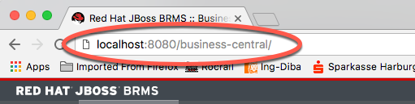

Login: demo-user, Password: change12_me

Navigate to `Authoring` and make sure you are seeing the right project.

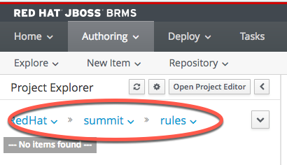

When opening this view the first time, you will have to "open" the project to
be able to see the included artifacts, like the prepared Decision Table.

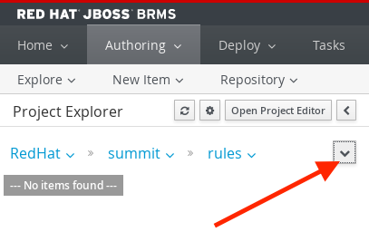

Continue drilling into the repository, untill you see the "Guided Decision Table"

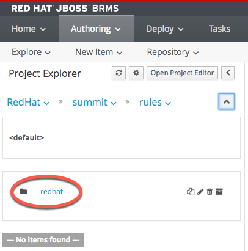

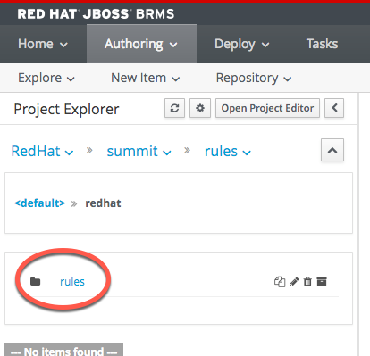

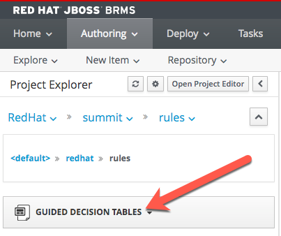

In the project open the section `Guided Decision Tables` and open the prepared
frame.

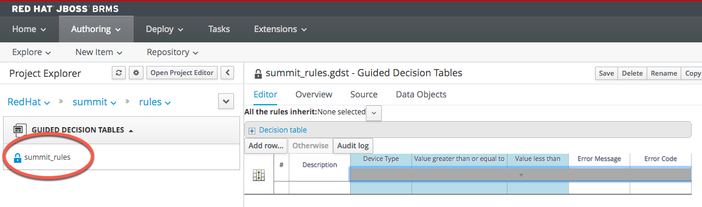

The Decision-Table is prepared for this lab. The columns of the table represent:

* **Description** is a name for a rule. It is not required to give every rule a name, but during debugging this might become handy!
* **Device Type** the 'DeviceType' this rule will need to match with. Values here, should be similar to the 'deviceType' you have used in the 'Software Sensor' configuration.
* **Value greater ...** as we are comparing against values, this column will
be the place to enter the lower number of a range.
* **Value less then** this column is for the higher value of the range.
* **Error Message** this column can be used to define any error text that you want to be returned
if given values should meet this rule.
* **Error Code** this column can be used to define any error number that you want to be returned
if given values should meet this rule. **Please be aware that this lab will consider `0` as no error and anything `>0`
as an error.**

=== Authoring rules in JBoss BRMS
To add new rules to the given Decision-Table, please click the `Add row` button

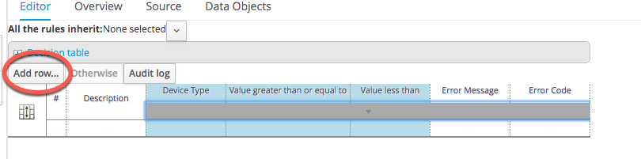

This will create a new and empty row. You can add values into the cells by double-clicking them.

Please fill in the data as shown

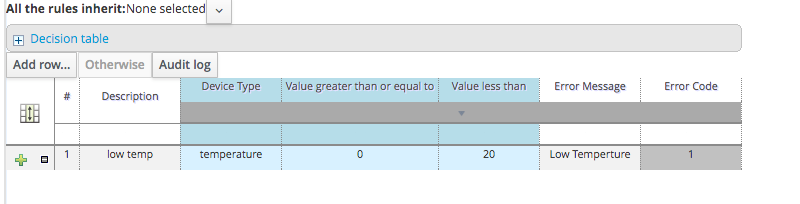

Proceed the same way to complete the rules as shown in the following image

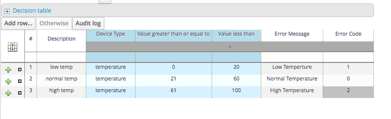

When you have entered your rules, you have so click `safe`. You can add a check-in
comments, but that is not required. Click `safe` again ...

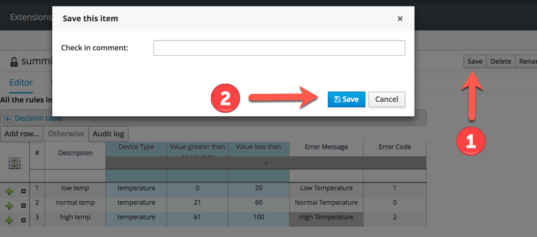

=== Authoring rules in JBoss BRMS
Before we can use the rules, we need to make them available, aka *deploy* them.

To do so, please click `Open Project Editor`

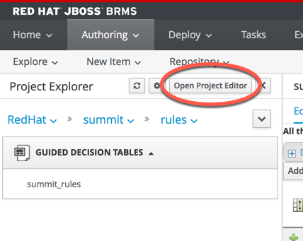

Select `Build->Build

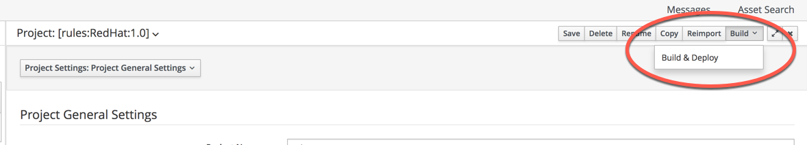

== Building and Running the *Business Rules Service*
Now that we have added a few rules to our decision table, we only need to build
a new version of the service and start it.

As of now, you should have a terminal open, in which you started Red Hat JBoss Fuse
and another terminal in which you did build and deployed the Routing Service.

You can use the same terminal again, to build and start the *Business Rules Service*

To do so, enter the following commands in your terminal session

 [demo-user@localhost IoT_Summit_Lab]$ cd
 [demo-user@localhost ~]$ cd IoT_Summit_Lab/
 [demo-user@localhost IoT_Summit_Lab]$ ./runRulesService.sh
 < removed a output >
 AMQ-Broker tcp://localhost:61616 ready to work!

It should also print

 Device-Type = temperature
 Device-ID   = 4711
 Payload     = 70
 Result      = 1
 ----------------------
 Sending <?xml version="1.0" encoding="UTF-8" standalone="yes"?><dataSet><timestamp>18.05.2016 10:46:22 766</timestamp><deviceType>temperature</deviceType><deviceID>4711</deviceID><payload>70</payload><required>0</required><average>0.0</average><errorCode>1</errorCode></dataSet>

as this is the message, which we did send to our environment, when we tested
the *Routing Service*.

== Sending a test messages
As during the previous lab, we will try this service by sending a test message
via the *Software Sensor* to our setup. The following should happen.

 1. *Software Sensor* sends a message with a high value via MQTT
 2. *Routing Service* will pick it up, transform the message and send it
 to an AMQP message queue.
 3. *Business Rules Service* will take the transformed message from the queue
 and will put it in another AMQP message queue, but only if a business rule
 told him to.

To perform this test, perform the following steps

 * Open a new terminal windows

image:images/openTerminal.png[]

 * Start the provided script *runHighSensor.sh*, which will send one message

 [demo-user@localhost Desktop]$ cd
 [demo-user@localhost ~]$ cd IoT_Summit_Lab/
 [demo-user@localhost IoT_Summit_Lab]$ ./runHighSensor.sh
 Starting the producer to send messages
 Sending '70,0'

 * The terminal window in which you started the *Business Rules Service*, should
 now show the debug-output with the received data and the XML string, which
 is forwarded to another AMQP message queue for further processing.

 AMQ-Broker tcp://localhost:61616 ready to work!
 Device-Type = temperature
 Device-ID   = 4711
 Payload     = 70
 Result      = 1
 ----------------------
 Sending <?xml version="1.0" encoding="UTF-8" standalone="yes"?><dataSet><timestamp>17.05.2016 15:08:59 265</timestamp><deviceType>temperature</deviceType><deviceID>4711</deviceID><payload>70</payload><required>0</required><average>0.0</average><errorCode>1</errorCode></dataSet>
 ----------------------

 * Another way to verify that the message was properly processed is to take a
 look at Red Hat JBoss Fuse console via 'http://localhost:8181', as in the previous
 lab. The count of messages enqueued and dequeued shoud now show that one message
 has been taken from 'message.to.rules' and placed into 'message.to.datacenter'.

image:images/testResult.png[]
