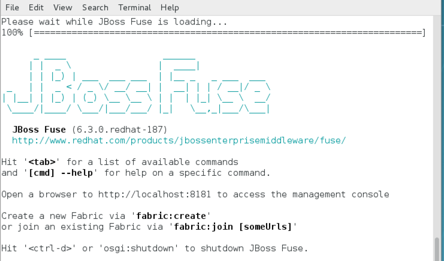

= IoT Summit Lab 2017

:Author:    Patrick Steiner
:Email:     psteiner@redhat.com
:Date:      03.02.2017

:toc: macro

toc::[]

== Content
This repository contains the material build for the 2017 Red Hat Summit.

The following sub-projects have been created

* https://github.com/PatrickSteiner/IoT_Summit_Lab/tree/master/Software_Sensor[Software Sensors]: a software sensor who could can be used to simulate sensor data creation.
* https://github.com/PatrickSteiner/IoT_Summit_Lab/tree/master/BusinessRulesService[Rules Service]: a service which receives data from a defined AMQ-Queue, validates those against Business Rules and drops the results in another defined AMQ-Queue
* https://github.com/PatrickSteiner/IoT_Summit_Lab/tree/master/RoutingService[Routing Service]: the service who receives, transforms and routes messages from one destination to the next.

== Lab 0 - Preparing the Lab Environment
If you should do these labs on an environment, which was not prepared for it,
please follow the https://github.com/PatrickSteiner/IoT_Summit_Lab/blob/master/BuildVM.adoc[instructions] on how to setup a lab environment.

== Lab 1 - Starting JBoss Fuse
We will start the JBoss Fuse server and will leave it running in the background. Deployment
to the server will be done "hot", which is definitely not a best-practice, but
for the sake of this lab, it's absolutely sufficient.

* Login to you lab-environment with

 username = 'demo-user'
 password = 'change12_me'

To start JBoss Fuse, please follow these simple steps

 * Open a new shell, as described in the previous section
 * Enter the following commands

  [demo-user@localhost ~]$ cd
  [demo-user@localhost ~]$ cd IoT_Summit_Lab
  [demo-user@iotlab IoT_Summit_Lab]$ ./runJBossFuse.sh

* Wait for the Red Hat JBoss Fuse to complete the start procedure

* To be able to process MQTT messages, Red Hat JBoss Fuse needs to install the
'camel-mqtt' OSGi features. To to this, enter the following simple command on the
'JBossFuse' command prompt

 JBossFuse:karaf@root> features:install camel-mqtt

* Minimize this shell, as we don't need it at the moment

image::images/minimize_fuse.png[]

== Lab 2 - Building and Running the Software Sensor
The instructions on building and running the *Software Sensor* are located https://github.com/PatrickSteiner/IoT_Summit_Lab/tree/master/Software_Sensor[here].

== Lab 3 - Building and Running the first Messageflow
The instructions on building and running the first Flow are located https://github.com/PatrickSteiner/IoT_Summit_Lab/tree/master/RoutingService[here].

== Lab 4 - Building and Running the Business Rules Service
The instructions on building and running the Business Rules Service are located https://github.com/PatrickSteiner/IoT_Summit_Lab/tree/master/BusinessRulesService[here].

== Lab 5 - Updating the Rules
The instructions to update the rules service so the messages to the datacenter can be filtered as per defined rules
are located https://github.com/PatrickSteiner/IoT_Summit_Lab/tree/master/UpdateRules[here].
