= IoT Summit Lab 2016 - Routing Service

:Author:    Patrick Steiner
:Email:     psteiner@redhat.com
:Date:      23.01.2016

:toc: macro

toc::[]

== Content

This repository contains the material needed to build and run the Business Rules Service
for the 2016 Red Hat Summit IoT Lab

== What does this Module do?
This module is responsible for providing the logic to handle messages. Core
tasks are

  * reading messages from Messagequeues
  * transforming messages from one dataformat ( CVS ) to another ( XML )
  * routing messages to their next destination, based on a predefined logic
  * routing messages to their next destination, based on the content of a message

== Configuration
The Rules Service can be configured via the following environment variables, which are similar
to the ones defined for the https://github.com/PatrickSteiner/IoT_Summit_Lab/tree/master/BusinessRulesService[Business Service].

[width="80%",frame="topbot",options="header"]
|==================================
| Variable |  Description | Default Value
| SOURCE_AMQ_BROKER | URL of the Message Broker who provides the Messagequeue to read Sensordata from | tcp://receiver:61616
| SOURCE_BROKER_ADMIN_UID | The username to connect to the source Messagebroker | admin
| SOURCE_BROKER_ADMIN_PASSWD | The password to connect to the source Messagebroker | change12_me
|==================================

== Flow 1 - Receive, Transform and Forward

For your convenience we provided code-frames for you to be able to
develop the JBoss Fuse logic.

=== Starting the development tooling
For our development activities, we will be using JBoss Developer Studio V8.1 (JBDS), an
Eclipse based tooling.

To start JBDS, double-click the provided icon on the dashboard.


In the `Project Explorer` Eclipse view, you will see our two project which we
will be using in later stages of our lab.

 * `businessRulesService` for our Rules Service
 * `routingService` for our Routing Service

image::images/image3.png[]


=== Opening the Flow Editor

To access these code-frames, double-click the provided `camel-context.xml` file.

image::images/openCamelContext.png[]

this will open the flow in it's visual editor.

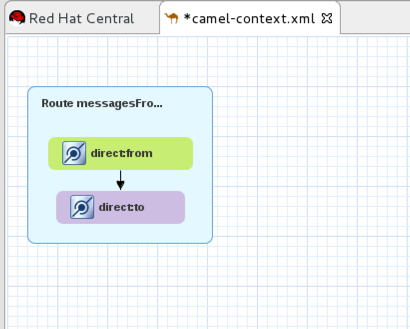

=== Developing the flow
The flow we will be developing will perform the following steps

 1. receive a comma separated values ( CSV ) MQTT message from any MQTT-Topic with the name `iotdemo/<something>/<something`
 2. transform the CSV message to XML
 3. send XML message to a AMQP Messagequeue

==== Adding the receiver to the flow
Open the property setting of the `direct:from` icon, also known as node, by selecting the icon and
then selecting the `Properties` pane in the Eclipse tooling.

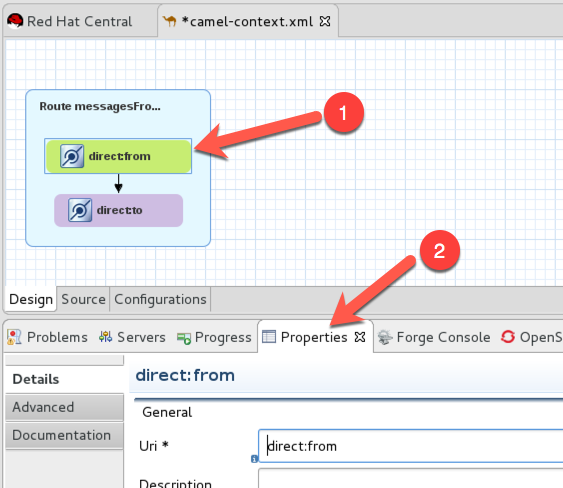

Change the `Uri` of the node to

```
mqtt:mqtt.temp.receiver?host=tcp://localhost:1883&subscribeTopicNames=iotdemo/#/#&userName=admin&password=change12_me&reconnectBackOffMultiplier=1
```

image::images/setMQTTReceiver.png[]

Let's analyze this long string:

 * *mqtt:* defines this node to be a MQTT connector
 * *mqtt.temp.receiver* defines a unique name with which this MQTT receiver identifies
 himself to a MQTT Broker
 * *host=tcp://localhost:1883* defines the URL of the MQTT Broker to which this receiver
 connects to
 * *subscribeTopicNames=iotdemo/\#/#* subscribes to any topic starting with `iotdemo`
 and has two more parts, which we subscribe to via wildcards
 * *userName=admin&amp;password=change12_me* defines the username and password which
 this receiver uses to authenticate to the MQTT Broker
 * *&amp;reconnectBackOffMultiplier=1* defines the Exponential backoff be used between reconnect attempts. Set to 1 to disable exponential backoff.

==== Changing the CSV message to a Java Object
In this step we will introduce the capabilities needed to

 1. extract the data from the MQTT Topic and the payload
 2. build an XML structure based the data from the MQTT Topic and the payload

Start by opening the *Palette* view and drag the *Bean* component onto the `camel-context.xml`

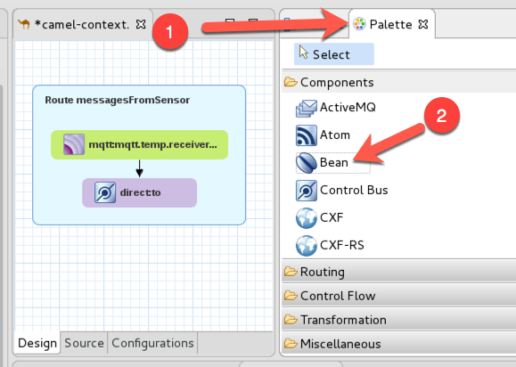

Your `camel-context.xml` should now look as in

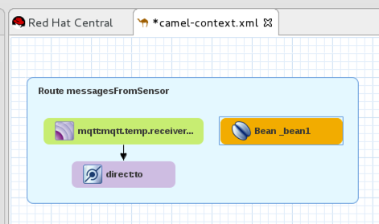

In the properties of the newly created `Bean`, please define the following values:

 * *Bean Type* to `com.redhat.demo.routingService.MyHelper`
 * *Method* to `enhanceMessage`
 * *ID* to `myHelper`
 * *Ref* to `myHelper`

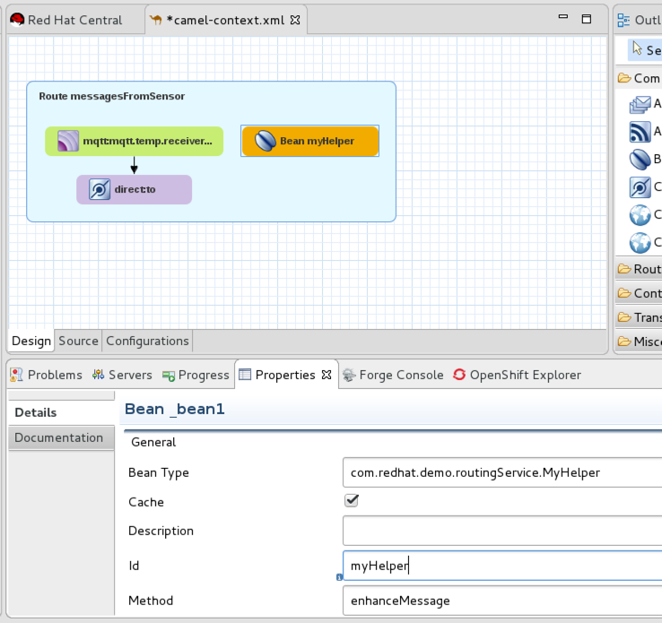

What does this Node do? It will take the CSV message from the MQTT Topic and will
hand if to a method `enhanceMessage` in the Java Class named `com.redhat.demo.routingService.MyHelper`, which
then creates an instance of Java Class `Dataset`, which represents all the data
we use and need.

If you want to see the Java code for `Dataset`, open the following file:

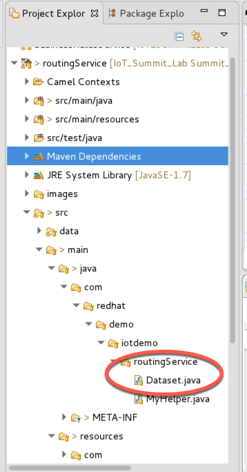

`com.redhat.demo.routingService.MyHelper` is a Java Object, which we provided to
you to show how simple JBoss Fuse can be extended with custom functionality.

If you want to see the Java code for this object, open the following file:

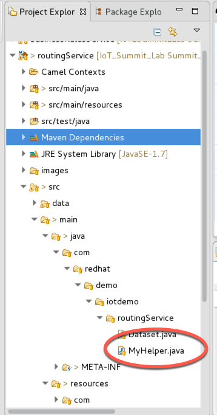

==== Connecting Bean
For the Bean to be used, we need to wire it into our flow.

Select the arrow symbol between the *mqtt* node and the *direct:to* node

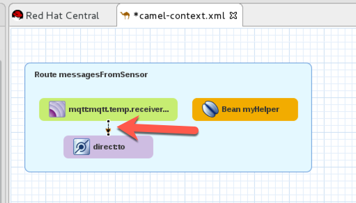

drag the tip of the arrow to hover over the *bean* and release it there. The result
will look like

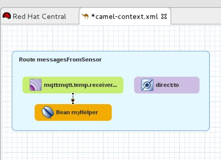

Changing this resulted in the message to be received via MQTT and then passed
to our bean.

==== Transforming the Java Object to XML
Now that we have all our relevant data transformed into a Java object, we can
use JBoss Fuse to transform it.

To do so, select the `Unmarshal` component from the `Palette` view and drag it
onto `camel-context.xml`

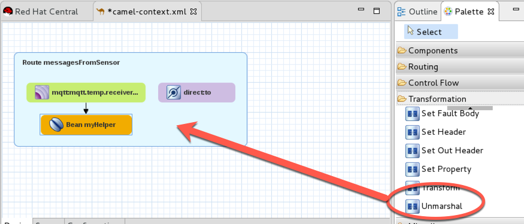

the result will look like

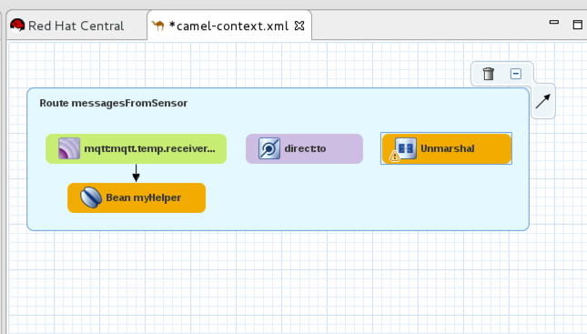

In the properties pane of the newly created Node, please change the `Ref` property to `bindyDataFormat`.

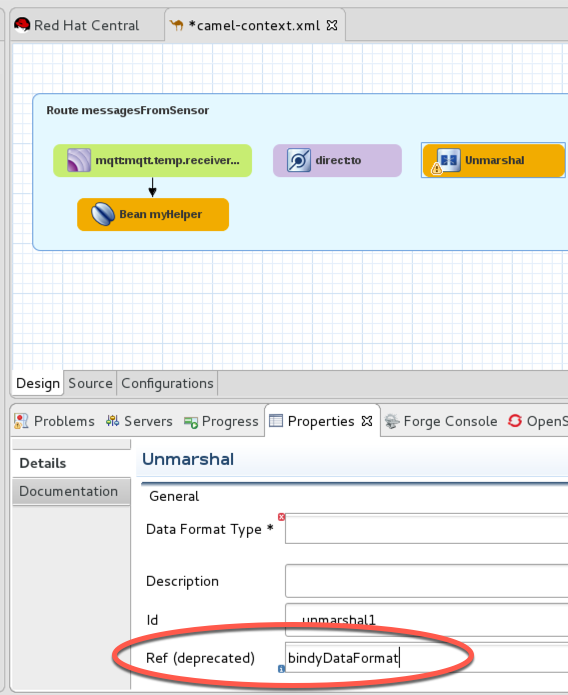

This tells JBoss Fuse which functionality to use to transform the Java Object to XML.

*This method is deprecated, we will update the instructions in the next version*

Now you need to wire the created components to the correct flow sequence, as shown in

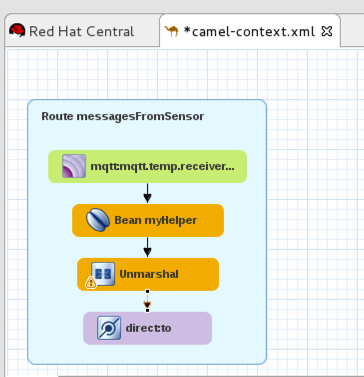

==== Adding the final send to the flow
Last thing to do is to configure the sending node, to do this please select
the `direct:to` node and change the property `Uri` to `activemqGateway:queue:message.to.rules`  as shown in the image below.

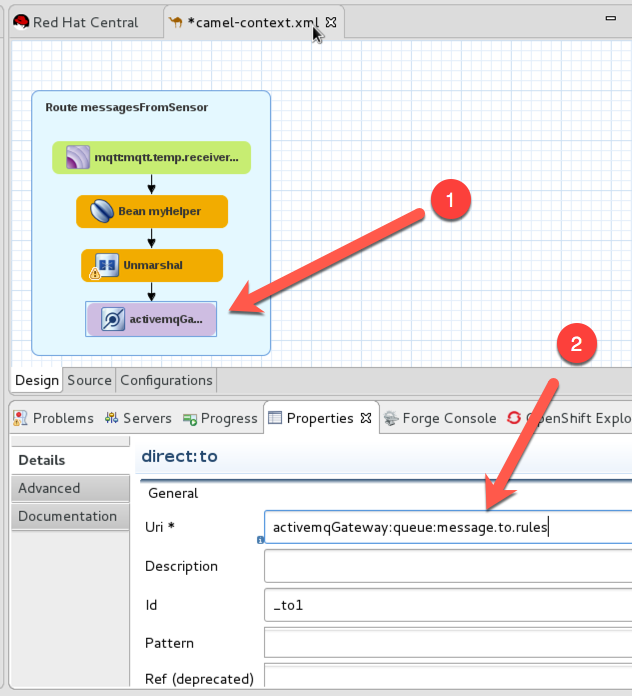

==== One more thing
To show the flexibility of building Camel routes, we will introduce one more
step to the route, which we created visually so far. This time we will change
the underlying Spring-XML file.

To access this, you just have to change the view-format or our route by clicking
the "source" - tab

image:images/changeView.png[]

You will be presented with the XML representation of our route, which includes
some preparation and definition steps and at the end, our route

  <route id="messagesFromSensor">
      <from id="_from1" uri="mqtt:mqtt.temp.receiver?host=tcp://localhost:1883&amp;amp;subscribeTopicNames=iotdemo/#/#&amp;amp;userName=admin&amp;amp;password=change12_me&amp;amp;reconnectBackOffMultiplier=1"/>
      <bean beanType="com.redhat.demo.routingService.MyHelper"
          id="myHelper" method="enhanceMessage"/>
      <unmarshal id="_unmarshal1" ref="bindyDataFormat"/>
      <to id="_to1" uri="activemqGateway:queue:message.to.rules"/>
  </route>

We will now have to add one more transformation, which will transform the message
from it's current XML-Document format into a String. This will make later processing
easier.

Please locate the following two lines

 <unmarshal id="_unmarshal1" ref="bindyDataFormat"/>
 <to id="_to1" uri="activemqGateway:queue:message.to.rules"/>

now add the transformation inbetween those

 <unmarshal id="_unmarshal1" ref="bindyDataFormat"/>
 <convertBodyTo type="java.lang.String"/>
 <to id="_to1" uri="activemqGateway:queue:message.to.rules"/>

Please do not forget to save your changes, as this will complete this exercise.

image:images/saveAll.png[]

=== Building and deploying the route
For your convenience, we created a script which will

 * build the Red Hat JBoss Fuse project
 * deploy it to our running JBoss Fuse Instance

To build and deploy, all you need to do is perform the following steps

* open a terminal

image:images/openTerminal.png[]

 * perform the following commands

 [demo-user@iotlab Software_Sensor]$ cd
 [demo-user@iotlab ~]$ cd IoT_Summit_Lab/
 [demo-user@iotlab IoT_Summit_Lab]$ ./runRoutingService.sh


=== Verify that the Camel route has been deployed
We can verify the deployment of our first Flow by doing the following steps

 * Open a browser

image:images/startFirefox.png[]

 * Open the admin console of Red Hat JBoss Fuse by browsing to it's URL

image:images/startHawtio.png[]

 * Enter the *admin* Username and *change12_me* as Password and click the *Log in* button

image:images/enterCredentials.png[]

 * Go to the *Logs* panel

image:images/openLogs.png[]

 * Look for the corresponding messages in the logs

image:images/viewLogs.png[]

=== Sending a test message
By now you should have the following elements of the IoT environment ready build

 * a software sensor to simulate data
 * a route to receive data via MQTT and forward in a different messageformat via AMQP

we can easily verify this, by doing the following:

 * Start the provided script *runHighSensor.sh*,  which will send one message. You
 can use the same terminal windows from which you initiated the build and deploy.

 [demo-user@localhost IoT_Summit_Lab]$ ./runHighSensor.sh
 Starting the producer to send messages
 Sending `70,0`

 * Open the *ActiveMQ* panel in the JBoss Fuse admin page

image:images/openActiveMQView.png[]

 * Click on the `Topic` tree and verify the number for "Enqueue" and "Dequeue" for
 our topic *iotdemo.temperature.4711*. This entry will tell you how many messages
 have been received on this MQTT-Topic and how many of these have been read from
 the Topic.

image:images/viewMQTTTopics.png[]

 * As our Flow was designed to take a message from the MQTT-Topic and put it into an AMQP
 queue, we should find our *dequeued* message in a *Queue*. Therefor click on *Queue* and
 verify the number of *Enqueued* messages in the *message.to.rules* queue.

image:images/viewAMQP.png[]

 * Last, but not least, we can verify if the new message is really transformed
 from CSV to XML. To do this, click on the queue-name in the tree-view and on *Browse*

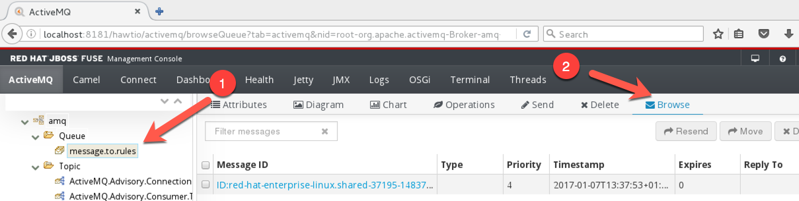

 * Select the message you want to see, we should only have one!

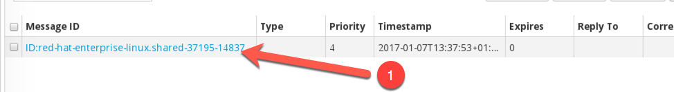

 * Be Happy!

image:images/messageContent.png[]


== Flow 2 - Filter and Forward to Backend

tbd
